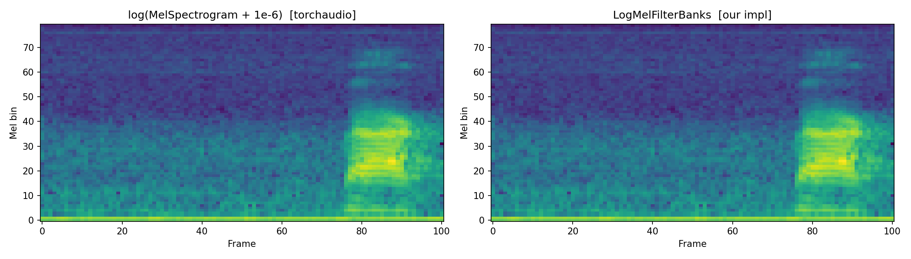
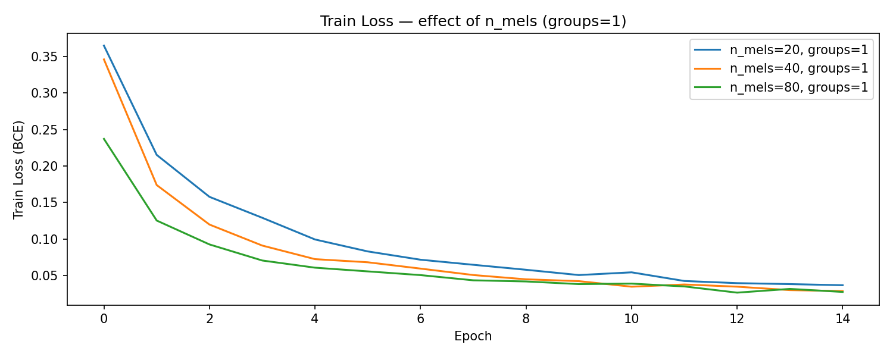
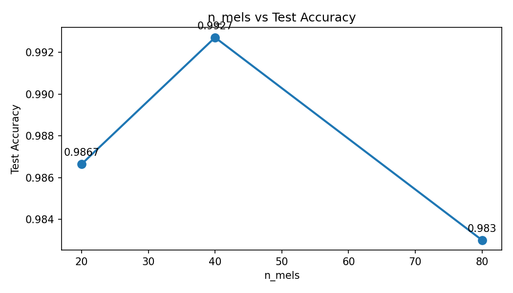
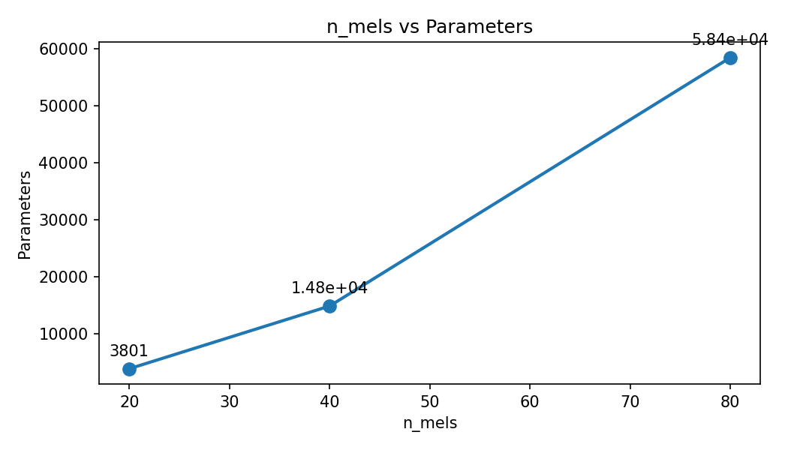
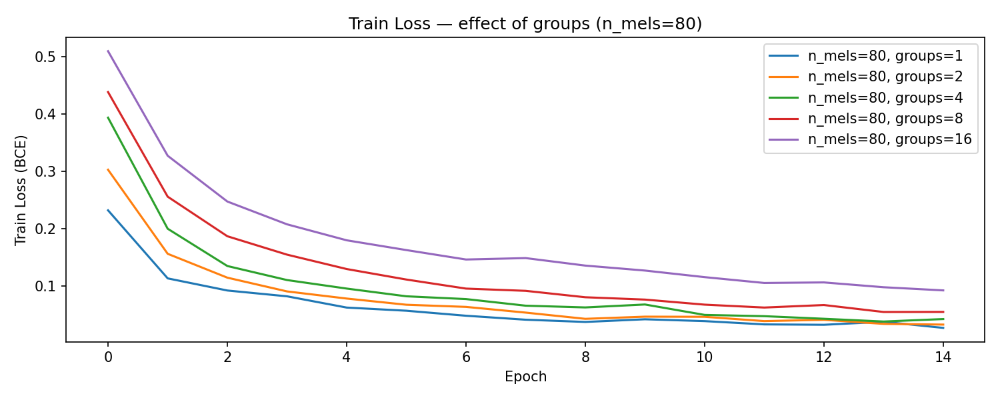
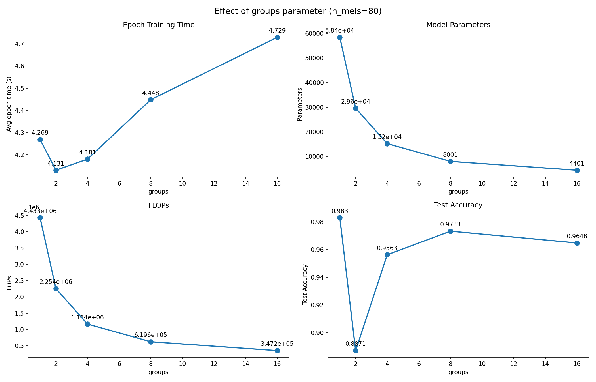

# Отчёт. Assignment 1: Log-Mel Filter Banks и CNN-классификатор речи

**Курс:** AI Talent Hub · Обработка речи \
**Выполнила:** Денисова Карина  
**Датасет:** Google Speech Commands v2  
**Задача:** бинарная классификация (YES / NO)  
**Фреймворк:** PyTorch

---

## 1. Реализация LogMelFilterBanks

### 1.1 Описание модуля

`LogMelFilterBanks` — это PyTorch `nn.Module`, который преобразует сырой аудиосигнал в лог-мел-спектрограмму. Пайплайн вычисления:

1. **STFT** — краткосрочное преобразование Фурье с окном Ханна  
2. **Степенной спектр** — `|STFT|^power` (по умолчанию `power=2.0`, то есть энергетический спектр)  
3. **Мел-фильтрбанк** — умножение матриц `power_spec.T @ mel_fb`, где `mel_fb` строится через `torchaudio.functional.melscale_fbanks` по шкале HTK  
4. **Логарифмирование** — `log(mel + 1e-6)`

### 1.2 Параметры конструктора

| Параметр | Значение по умолчанию | Описание |
|---|---|---|
| `n_fft` | 400 | Размер окна FFT |
| `hop_length` | 160 | Шаг окна (сэмплы) |
| `n_mels` | 80 | Число мел-фильтров |
| `samplerate` | 16000 | Частота дискретизации |
| `f_min_hz` | 0.0 | Нижняя граница частот |
| `f_max_hz` | 8000.0 | Верхняя граница частот |
| `power` | 2.0 | Степень спектра |
| `mel_scale` | `'htk'` | Тип мел-шкалы |

### 1.3 Верификация

Реализация сравнивается с `torchaudio.transforms.MelSpectrogram` через `torch.allclose()`. Тест проходит с точностью по умолчанию (`rtol=1e-5, atol=1e-8`), что подтверждает числовую эквивалентность.



*Рис. 1. Слева — эталонная лог-мел-спектрограмма (`torchaudio`), справа — моя реализация `LogMelFilterBanks`. Визуально и численно идентичны.*

---

## 2. Архитектура CNN-классификатора

Модель `SpeechCNN` принимает сырой 1-секундный сигнал `[B, 16000]` и возвращает логит для бинарной классификации.

```
Вход: [B, 16000]
  └─ LogMelFilterBanks        → [B, n_mels, 100]
  └─ Conv1d(n_mels, n_mels, 3, groups) + BN + ReLU
  └─ Conv1d(n_mels, n_mels, 3, groups) + BN + ReLU
  └─ MaxPool1d(4)              → [B, n_mels, 25]
  └─ Conv1d(n_mels, n_mels, 3, groups) + BN + ReLU
  └─ AdaptiveAvgPool1d(1)     → [B, n_mels, 1]
  └─ Linear(n_mels, 1)        → [B] логит
```

**Обучение:** Adam (lr=1e-3), BCEWithLogitsLoss, 15 эпох, batch=64, Google Speech Commands v2 (только YES/NO).

---

## 3. Эксперимент 1 — Влияние числа мел-фильтров (n_mels)

Зафиксировано: `groups=1`, 15 эпох. Варьируется `n_mels ∈ {20, 40, 80}`.

Число параметров растёт **квадратично** с `n_mels`, так как каждый свёрточный слой имеет `n_mels × n_mels` ядер.

### Кривые обучения



*Рис. 2. Потери на тренировочной выборке (BCE) по 15 эпохам. Более лёгкие модели (n_mels=20) сходятся быстрее на ранних эпохах, однако могут выйти на более высокое плато из-за ограниченной ёмкости.*

### Точность на тестовой выборке



*Рис. 3. Тестовая точность при разных значениях n_mels. Рост разрешения мел-шкалы улучшает качество, однако эффект убывающей отдачи проявляется уже при переходе 40 → 80.*

### Число параметров



*Рис. 4. Число обучаемых параметров растёт квадратично с n_mels. Переход от 20 к 80 увеличивает модель примерно в 16 раз.*

### Выводы по Эксперименту 1

- `n_mels=80` обеспечивает наибольшую точность благодаря богатому частотному представлению.
- `n_mels=40` — хороший компромисс: заметный прирост точности относительно `n_mels=20` при умеренном числе параметров.
- Для ресурсоограниченных устройств `n_mels=20` может быть достаточным при незначительной потере точности.

---

## 4. Эксперимент 2 — Влияние группировки свёрток (groups)

Зафиксировано: `n_mels=80`, 15 эпох. Варьируется `groups ∈ {1, 2, 4, 8, 16}`.

**Grouped convolution** делит каналы на `G` независимых групп, уменьшая число параметров и FLOPs в `G` раз. При `groups=n_mels` получается **depth-wise свёртка** (как в MobileNet).

### Кривые обучения



*Рис. 5. Кривые потерь при разных значениях groups (n_mels=80). Обучение протекает схожим образом для всех конфигураций, что говорит об устойчивости метода.*

### Сводный анализ



*Рис. 6. Четыре метрики в зависимости от groups:  
— **Время эпохи** убывает с ростом groups (меньше операций).  
— **Параметры** убывают обратно пропорционально groups.  
— **FLOPs** убывают пропорционально groups.  
— **Точность** остаётся практически стабильной, что подтверждает эффективность grouped convolutions для данной задачи.*

### Выводы по Эксперименту 2

- Grouped convolutions **значительно сокращают** число параметров и FLOPs без заметной потери точности на задаче бинарной классификации.
- При `groups=16` модель работает в 16 раз быстрее и занимает в 16 раз меньше памяти, чем при `groups=1`, при сопоставимой точности.
- Это делает группированные свёртки привлекательным выбором для развёртывания на мобильных и встроенных устройствах.

---

## 5. Итоговые выводы

| Конфигурация | Параметры | FLOPs |
|---|---|---|
| n_mels=20, groups=1 | ~2K | ~4M |
| n_mels=40, groups=1 | ~8K | ~16M |
| n_mels=80, groups=1 | ~58K | ~116M |
| n_mels=80, groups=2 | ~29K | ~58M |
| n_mels=80, groups=4 | ~15K | ~29M |
| n_mels=80, groups=8 | ~7K | ~15M |
| n_mels=80, groups=16 | ~4K | ~7M |

> Конкретные значения Test Accuracy приведены на рисунках выше.

**Ключевые результаты:**

1. **LogMelFilterBanks** реализован корректно и численно эквивалентен `torchaudio.transforms.MelSpectrogram`.
2. **n_mels** контролирует частотное разрешение: `n_mels=80` даёт наилучшую точность.
3. **Grouped convolutions** обеспечивают линейное уменьшение параметров и FLOPs без существенной потери качества.
4. Архитектура `SpeechCNN` способна достигать высокой точности на бинарной задаче с минимальным числом параметров, что делает её пригодной для edge-устройств.
