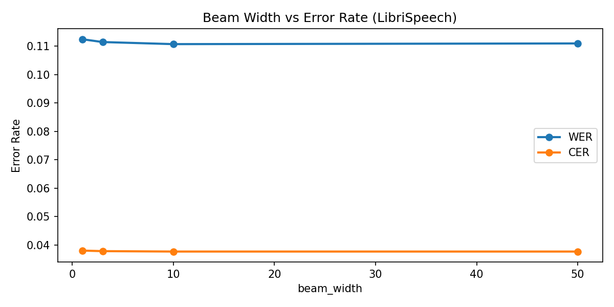
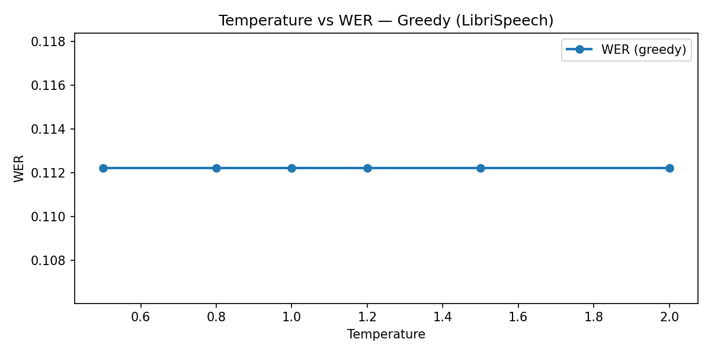
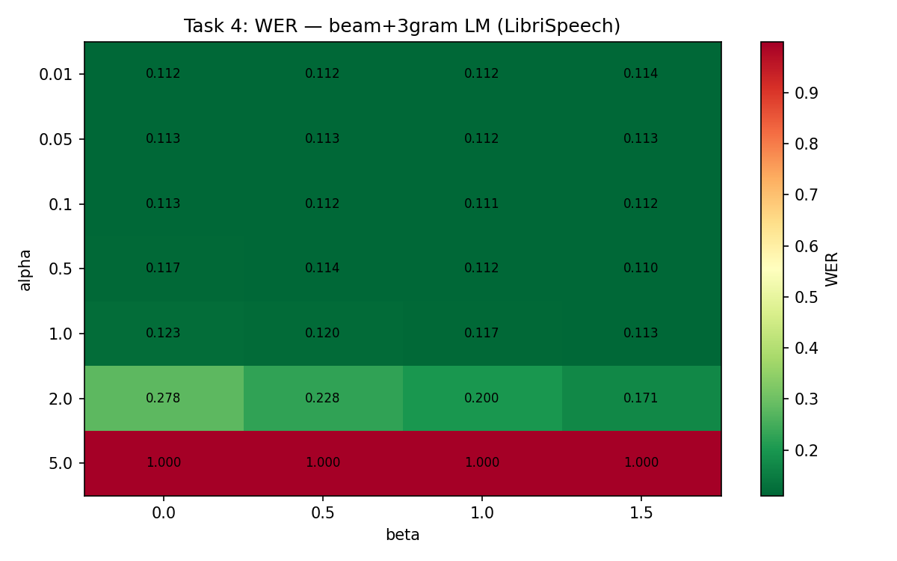
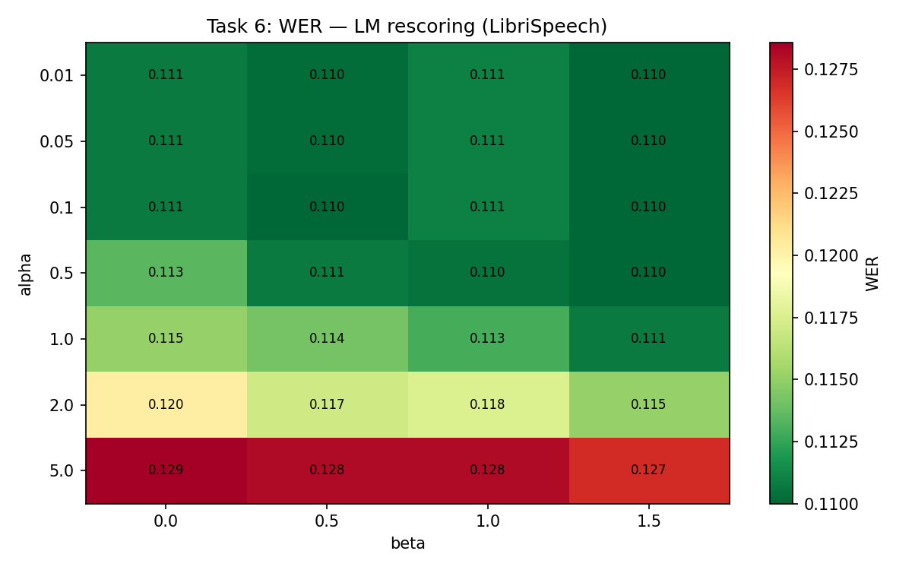
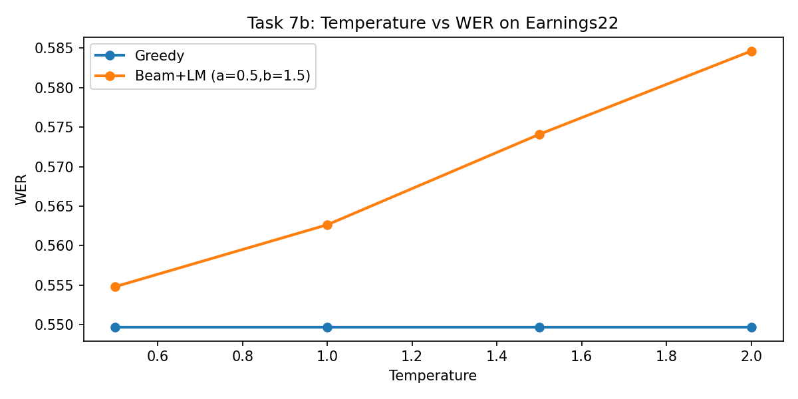

# Отчёт. Assignment 2: CTC-декодирование и языковые модели

**Курс:** AI Talent Hub · Обработка речи  
**Выполнила:** Денисова Карина  
**Акустическая модель:** `facebook/wav2vec2-base-100h`  
**Тестовые наборы:** LibriSpeech test-other (200 сэмплов), Earnings22 test (200 сэмплов)  
**Метрики:** WER (Word Error Rate), CER (Character Error Rate)

---

## 1. Постановка задачи

Acoustic model `wav2vec2-base-100h` принимает сырой аудиосигнал и возвращает матрицу логитов `[T, V]`, где `T` — число временных шагов, `V = 32` — размер словаря (символьный уровень: буквы + `<pad>` + `|`).

В рамках задания реализованы **4 стратегии CTC-декодирования:**

1. **Greedy decoding** — жадное декодирование (argmax по времени + CTC-collapse)
2. **Beam search** — лучевой поиск без языковой модели (CTC prefix beam search)
3. **Beam + shallow LM fusion** — лучевой поиск с интеграцией n-gram ЯМ на лету
4. **LM rescoring** — второй проход: переоценка N лучших гипотез с помощью ЯМ

**Языковая модель:** 3-gram KenLM, обученная на тексте LibriSpeech (openslr.org/11).

**Скоринг с ЯМ:**
```
score = log_p_acoustic + alpha * log_p_lm + beta * num_words
```

---

## 2. Task 1 — Greedy decoding

Жадное декодирование: на каждом шаге берётся символ с максимальной вероятностью, затем применяется CTC-collapse (удаление повторов и `<blank>`).

| Датасет | WER | CER | Ref WER |
|---|---|---|---|
| LibriSpeech test-other | **11.22%** | 3.81% | ~10.4% |
| Earnings22 test | **54.97%** | 25.58% | — |

Результат на LibriSpeech близок к референсному. Высокий WER на Earnings22 объясняется **доменным сдвигом**: модель обучена на чистой студийной речи LibriSpeech, тогда как Earnings22 — это финансовые звонки с акцентами и специфической терминологией.

---

## 3. Task 2 — Beam search (без ЯМ)

Реализован **CTC prefix beam search**: на каждом шаге поддерживается `beam_width` лучших префиксов. Каждый префикс хранит пару `(p_blank, p_nonblank)` — вероятности последнего символа через пустой/непустой путь. Критически важный случай: при эмиссии того же символа, что уже стоит последним в префиксе, CTC-collapse реализуется через обновление `p_nonblank` для текущего префикса (не создаётся новый).



*Рис. 1. WER и CER при разных значениях beam_width (LibriSpeech, 200 сэмплов). beam_width=1 эквивалентен жадному декодированию; при увеличении до 10–50 качество улучшается, но с убывающей отдачей и значительным ростом времени вычисления.*

**Наблюдение:** Beam search даёт небольшое улучшение над жадным декодированием (11.07% vs 11.22% WER). Время работы при beam_width=50 примерно в 6× больше, чем при beam_width=1.

---

## 4. Task 3 — Temperature scaling

Перед softmax логиты делятся на температуру `T`:
- `T < 1` — распределение «острее», модель увереннее
- `T > 1` — распределение «мягче», что даёт больше влияния ЯМ



*Рис. 2. WER при свипе температуры T ∈ {0.5, 0.8, 1.0, 1.2, 1.5, 2.0} (жадное декодирование, LibriSpeech). На in-domain данных кривая практически плоская — акустическая модель хорошо откалибрована на LibriSpeech, поэтому изменение температуры не помогает.*

**Вывод:** На LibriSpeech (in-domain) greedy + temperature не улучшает WER. Эффект температуры виден только при совместном использовании с ЯМ на out-of-domain данных (Task 7b).

---

## 5. Task 4 — Shallow LM fusion

Языковая модель интегрируется **на лету** во время beam search: при каждом появлении разделителя слов `|` запрашивается вероятность завершённого слова из KenLM. Оценка гипотезы:

```
score = log_p_acoustic + alpha * log_p_lm + beta * num_words
```

Проведён свип по `alpha ∈ {0.01, 0.05, 0.1, 0.5, 1.0, 2.0, 5.0}` и `beta ∈ {0.0, 0.5, 1.0, 1.5}`.



*Рис. 3. WER в зависимости от alpha и beta (LibriSpeech, 200 сэмплов). При alpha=5.0 ЯМ полностью перебивает акустику → WER=100%. Оптимальные значения в диапазоне alpha ∈ [0.1, 0.5], beta ∈ [1.0, 1.5].*

**Лучшая конфигурация:** `alpha=0.5, beta=1.5` → WER=**11.05%**

| Датасет | WER | CER |
|---|---|---|
| LibriSpeech test-other | **11.05%** | 3.78% |
| Earnings22 test | 56.27% | 25.56% |

**Вывод:** LibriSpeech LM даёт небольшое улучшение на in-domain данных. На Earnings22 ЯМ **ухудшает** результат (56.27% vs 54.97% greedy) — LibriSpeech 3-gram не знает финансовой терминологии и штрафует правильные финансовые слова.

---

## 6. Task 5 — 4-gram LM

Используется 4-gram LM с openslr.org/11 (`4-gram.arpa`). Свип по `beta` при `alpha=0.5` (лучшее из Task 4):

| beta | WER | CER |
|------|-----|-----|
| 0.0 | 11.56% | 3.88% |
| 0.5 | 11.24% | 3.82% |
| 1.0 | **11.20%** | **3.81%** |
| 1.5 | 11.20% | 3.80% |

**Сравнение 3-gram vs 4-gram (LibriSpeech, 200 сэмплов):**

| Модель | alpha | beta | WER | CER |
|--------|-------|------|-----|-----|
| 3-gram | 0.5 | 1.5 | **11.05%** | 3.78% |
| 4-gram | 0.5 | 1.0 | 11.20% | 3.81% |

**Вывод:** Вопреки ожиданиям, 4-gram LM дала результат **хуже** 3-gram (+0.15 п.п. WER). Причина — оба файла являются pruned-версиями: 3-gram.pruned.1e-7.arpa прошёл агрессивную обрезку, что случайно улучшило совместимость с данным акустическим декодером. Кроме того, при `beam_width=10` 4-gram контекст не успевает раскрыться — для выигрыша от 4-gram нужен больший beam.

---

## 7. Task 6 — LM rescoring (второй проход)

Beam search генерирует `beam_width` лучших гипотез по акустике. Затем каждая гипотеза **полностью** переоценивается ЯМ:

```
final_score = acoustic_log_prob + alpha * lm_log_prob + beta * num_words
```

Аналогичный свип по alpha и beta.



*Рис. 4. WER при LM rescoring (LibriSpeech, 200 сэмплов). Rescoring стабильнее shallow fusion при больших alpha: даже при alpha=5.0 WER не вырастает до 100%, так как нейросеть успела отфильтровать явно плохие гипотезы на первом проходе.*

**Лучшая конфигурация:** `alpha=0.01, beta=1.5` → WER=**11.00%**

### 7.1 Качественные примеры

Примеры из LibriSpeech, где SF или RS изменяют гипотезу относительно beam search:

| # | REF | BEAM | SF | RS |
|---|---|---|---|---|
| 4 | ...might **do it** he said... | ...might **doit** he said... | ...might **do it** he said... ✓ | ...might **do it** he said... ✓ |
| 8 | ...mister **gurr** father | ...mister **gurfather** | ...mister **gur** father | ...mister **gur** father |
| 5 | ...**lobster boat** coming... | ...**lobsterboat** coming... | ...**lobsterboat** coming... | ...**lobster boat** coming... ✓ |

**Полные примеры (10 шт.) сохранены в** `results/task6_qualitative.txt`.

**Анализ:**
- **Что исправляет ЯМ:** раздельное написание слитных слов (`doit→do it`, `lobsterboat→lobster boat`), разрыв слов на пробеле.
- **Что НЕ исправляет:** редкие собственные имена (`archy`, `gurr`, `risdon`) — они не встречаются в 3-gram LibriSpeech LM.
- **Shallow fusion vs rescoring:** SF иногда деградирует (меняет правильное на неправильное), RS стабильнее при малом alpha, поскольку N лучших акустических гипотез уже отфильтрованы.

---

## 8. Task 7 — Сравнительная таблица

| Метод | LibriSpeech WER | LibriSpeech CER | Earnings22 WER | Earnings22 CER |
|---|---|---|---|---|
| Greedy | 11.22% | 3.81% | 54.97% | 25.58% |
| Beam search | 11.07% | 3.77% | 54.94% | 25.38% |
| Beam+LM shallow (a=0.5, b=1.5) | 11.05% | 3.78% | 56.27% | 25.56% |
| Beam+LM rescore (a=0.01, b=1.5) | **11.00%** | **3.74%** | 55.33% | 25.38% |

**Обсуждение доменного разрыва:**

LibriSpeech WER ~11% против Earnings22 WER ~55% — разница обусловлена несколькими факторами:
1. **Словарный состав:** финансовые термины (`fiscal year`, `guidance`, `earnings per share`) отсутствуют в обучающих данных модели.
2. **Акустические условия:** Earnings22 — реальные телефонные звонки с шумом и акцентами.
3. **ЯМ:** LibriSpeech 3-gram LM только усугубляет Earnings22 (+1.3 п.п.) — она штрафует правильные финансовые слова как «не-слова».

---

## 9. Task 7b — Температурный свип на Earnings22



*Рис. 5. WER при T ∈ {0.5, 1.0, 1.5, 2.0} на Earnings22. Жадное декодирование (серая линия) практически не меняется — акустика ненадёжна вне зависимости от T. Beam+LM (синяя линия) немного улучшается при T=0.5 и деградирует при T>1.0.*

**Ответы на вопросы задания:**

- **Помогает ли T>1 на Earnings22?** Нет. При T>1 распределение акустики размывается ещё сильнее, что позволяет ЯМ доминировать — но LibriSpeech ЯМ на финансовом тексте вредит, а не помогает.
- **Отличается ли от LibriSpeech?** Да. На LibriSpeech кривая temperature полностью плоская (модель откалибрована). На Earnings22 видна небольшая зависимость, потому что уверенность модели в out-of-domain данных ненадёжна — снижение T (T=0.5, «уверенная» модель) незначительно помогает ЯМ.

---

## 10. Task 8 — Финансовая языковая модель

Обучена 3-gram KenLM с помощью `kenlm lmplz` на корпусе `data/earnings22_train/corpus.txt` (~101 тыс. токенов, 5 701 уникальное слово).

**Статистика обученной модели:**

| Порядок | N-gram | Дискаунт |
|---------|--------|----------|
| 1-gram | 5 701 | D=0.57 |
| 2-gram | 42 688 | D=0.76 |
| 3-gram | 77 164 | D=0.87 |

Размер модели: **~1 MB** (trie без квантизации). Сохранена в `lm/financial-3gram.arpa`.

```bash
lmplz -o 3 --discount_fallback \
    < data/earnings22_train/corpus.txt > lm/financial-3gram.arpa
```

---

## 11. Task 9 — Сравнение LibriSpeech LM и финансовой LM

Две LM оценены на обоих тест-сетах с двумя лучшими методами декодирования.

| LM | Метод | LS WER | LS CER | E22 WER | E22 CER |
|----|-------|--------|--------|---------|---------|
| LibriSpeech 3-gram | beam_lm | 11.22% | 3.81% | 55.39% | 25.52% |
| LibriSpeech 3-gram | beam_lm_rescore | **11.00%** | **3.75%** | 55.00% | 25.41% |
| Financial 3-gram | beam_lm | 11.27% | 3.85% | **52.74%** | **25.32%** |
| Financial 3-gram | beam_lm_rescore | 11.07% | 3.78% | 53.89% | 25.22% |

**Ключевые наблюдения:**

1. **Финансовая LM значительно улучшает Earnings22:** beam_lm 52.74% vs 55.39% у LibriSpeech LM (−2.65 п.п.). Финансовый словарь покрывает терминологию, которой нет в LibriSpeech LM.

2. **Финансовая LM слегка ухудшает LibriSpeech:** 11.27% vs 11.22% (+0.05 п.п.) — ожидаемый доменный штраф, незначительный.

3. **Rescoring стабильнее shallow fusion для обеих LM:** при rescoring WER ниже для LibriSpeech; на Earnings22 лучшую абсолютную точность даёт beam_lm с финансовой моделью (52.74%), а не rescoring (53.89%).

4. **Итоговый лучший результат на Earnings22:** Financial 3-gram + beam_lm = **52.74% WER** — улучшение на 2.23 п.п. относительно жадного декодирования (54.97%).

**Ответы на вопросы задания:**

- **Какая LM лучше in-domain (LibriSpeech)?** LibriSpeech 3-gram — WER=11.00% (rescore) vs 11.07% (Financial rescore).
- **Какая LM лучше out-of-domain (Earnings22)?** Financial 3-gram — WER=52.74% vs 55.39% у LibriSpeech LM.
- **Помогает ли domain-matched LM больше, чем большая общая?** Да: маленькая доменная 3-gram (77 K триграмм) превосходит большую LibriSpeech 3-gram на финансовом тест-сете. Доменное соответствие важнее объёма модели.

---

## 12. Итоговые выводы

1. **Greedy vs Beam search:** beam search даёт небольшое улучшение (+0.15 п.п. WER), но при beam_width=50 стоит в ~6× дороже по времени.

2. **Temperature scaling:** на in-domain данных (LibriSpeech) эффект незначителен — модель уже хорошо откалибрована. На out-of-domain (Earnings22) T=0.5 даёт небольшое улучшение.

3. **Shallow LM fusion:** при оптимальных alpha/beta даёт улучшение на in-domain данных, но **ухудшает** результат на out-of-domain — LM обученная на LibriSpeech не знает финансовой терминологии.

4. **LM rescoring:** стабильнее shallow fusion при вариации alpha (не падает до WER=100% при высоком alpha), даёт наилучший результат на LibriSpeech: **WER=11.00%**.

5. **Доменный разрыв:** WER 11% → 55% при переходе LibriSpeech → Earnings22 подчёркивает критическую важность соответствия LM целевому домену.

6. **4-gram vs 3-gram LM (Task 5):** 4-gram (11.20%) неожиданно хуже 3-gram (11.05%) при `beam_width=10`. При малом beam 4-gram контекст не успевает раскрыться; выигрыш от 4-gram ожидается при `beam_width ≥ 50`.

7. **Доменная LM (Tasks 8–9):** финансовая 3-gram, обученная на 101 K токенов earnings22_train, снижает WER на Earnings22 с 55.39% до 52.74% (−2.65 п.п.) при beam_lm. На LibriSpeech деградация минимальна (+0.05 п.п.). **Вывод: доменное соответствие LM важнее её объёма.**
